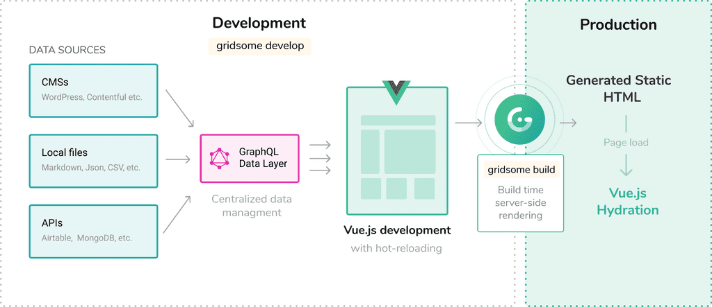

To maximise my time tooling around with architectures and design patterns I wanted my blog to be as effortless as possible to maintain and update. This post walks through how I'm using Markdown files to generate posts for my blog and highlights some of the benefits of using Gridsome and serving static files.

Put simply, my mini wishlist for the project was:
- Quick to post new content
- Fast load times
- Vue based
- Simple to host
- Learn something new when building

# Git Some Gridsome 🤘
After some research I found Gridsome. Having previously dabbled with Gatsby and React for static site generation, the similarities between the two, and the great documentation made it very easy to jump straight in.

I'm not going to explain how Gridsome works (they have good [documentation](https://gridsome.org/docs/how-it-works) for that), but we all love a quick overview...

Gridsome is a static site generator that holds hands with VueJS, and together they generate sweet sweet static files for us to serve how we please. The benefit here is that static files are fast, secure and easy to host.


*How Gridsome works - from the [Gridsome documentation](https://gridsome.org/docs/how-it-works)*

I'm generating posts by creating Markdown files in my project. A plus here is that I can use VS Code and all my usual hotkeys to write posts - *#efficient* 

Using the Markdown content, a GraphQL data layer is created and this sits just behind the Vue SPA. This is then queried from within Vue components, much like any other API, and the data can be consumed as normal. Effectively, a mini-database is being created from the local markdown files which be queried via GraphQL.

# GraphQL, you say? 🧐
The GraphQL layer created by Gridsome allows you to query your data and specify only the fields you're interested in for the given view etc. Again, their [documentation](https://graphql.org/learn/) is really good for learning the basics and seeing what it can offer.

First off, I declare some properties at the top of each post (or `.md` file). The usual fields like title and description along with any other metadata like date posted and published.

```markdown
title: Markdown and Gridsome for Content Generation
published: true
description: How I'm using Markdown files with Gridsome and Vue to generate content for my blog.
date: 2019-08-10
category: Client side
slug: blog-content-generation
excerpt: To maximise my time learning about new architectures and design patterns I wanted my blog to be as effortless as possible to maintain, update and post new content. This post walks through how I'm using Markdown files to generate posts for my blog and explains some of the benefits of using Gridsome and serving static files.
```

This data is grabbed from the top of each post and added to the database during the build process. From here, this data can be queried and the API will return the specified fields.

```javascript
<page-query>
query AllPosts {
  posts: allPost(filter: { published: { eq: true }}) {
    pageInfo {
      totalPages
      currentPage
    }
    edges {
       node {
        id
        published
        title
        excerpt
        slug
        date (format: "Do MMMM, YYYY")
        category {
          title
        }
      }
    }
  }
}
</page-query>
```
*GraphQL query returning published posts and related data fields for my blog page*


Once the data is retrieved, it can be accessed via the global `$page` property from within the component. For example:
```javascript
<BlogCard
      v-for="edge in $page.posts.edges"
      :key="edge.node.id"
      :title="edge.node.title"
      :excerpt="edge.node.excerpt"
      :category="edge.node.category.title"
      :slug="edge.node.slug"
      :date="edge.node.date"
    />
```
*Generating a BlogCard component for every blog post and passing its data as props*

The end result of this is the [blog](/blog) page you were just on.

# Conclusion
I have plans for my site to also become a portfolio to showcase projects and such, so the blog was just the first phase to get the site up and running. That said, it's always useful to evaluate the project's goals:

**Quick to post new content:** Writing posts in Markdown feels very streamlined. Pushing the new file to the Github repo automatically triggers Netlify to re-build the project and host the newly generated static files.

**Fast load times:** As page content is pre-rendered at deploy-time, rather than waiting for the page to be built by the server, the TTFB (time to first byte) is extremely low. Couple this with the automatic code splitting offered by Gridsome to prevent unnecessary loading of code and this results in a blazing fast site 🔥🔥🔥

**Vue based:** Gridsome works with Vue. So any new knowledge gained from maintaining and updating the site can be used in my day-to-day coding at work.

**Simple to host:** Static files can be hosted anywhere. I chose to use Netlify and connect my project repo for automatic site updates everytime the master branch is pushed to. I'd highly recommend Netlify as the process of setting up my hosting took about 2 minutes - #noJokes.

**Learn something new when building:** Even though I'd dabbled with Gatsby and React before (Gatsby also uses a GraphQL data layer), I have definitely learned more about GraphQL as I've been working on my site with Gridsome.

And that's that! I'm happy with where the site is at launch and I'll continue to develop it and push new posts as interesting topics pop up, but until then feel free to have a gander at the [Github repo](https://github.com/tappyy/personal-site) to see the source code.

### Further Reading 📖
Just some useful links that are related to this post 😃

- [Gridsome](https://gridsome.org/)
- [GraphQL](https://graphql.org/)
- [VueJS](https://vuejs.org/)