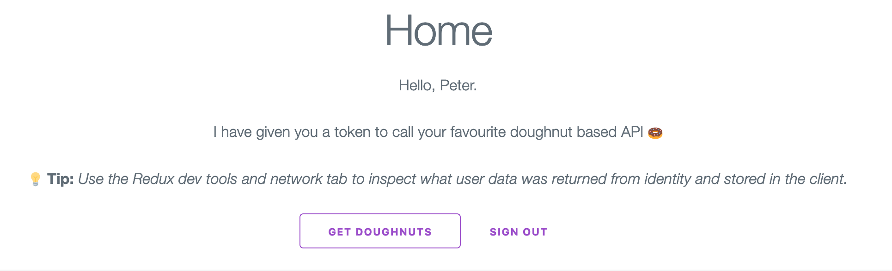

Having previously worked with IS4 in a .NET Core MVC application, I was curious how OIDC would be implemented in a standalone React app using JWT to access a web API.

I put this small demo together with the following objectives:
- Authenticate a React app user via Identity Server 4 using OIDC.
- Store authenticated user details in a central store in the React app.
- Have a public and a protected route within the app. Only authenticated users can access protected route.
- Fetch data from a protected web API using a JWT. Only authenticated users can access the API.

# Basic Architecture
- React app will implement Redux and serve as the customer facing site.
- Identity Server 4 will be used to implement OpenID Connect and authenticate users.
- .NET Web API project will be have a protected enpoint that will serve up some doughnut-y goodness 🍩.

# Identity Server 🤖
Starting with one of the .NET templates provided by Identity Server, we just need to configure the clients, API resources and test users on IS. For the purpose of this demo I will just create a single client, API resource and test user: Peter Parker 🕷️.

The `GetClients` function of `config.cs` is configured as follows:
```csharp
public static IEnumerable<Client> GetClients()
{
    return new[]
    {
        new Client
        {
            ClientId = "wewantdoughnuts", // unique ID for this client
            ClientName = "We Want Doughnuts", // human-friendly name displayed in IS
            ClientUri = "http://localhost:3000", // URL of client

            AllowedGrantTypes = GrantTypes.Implicit, // how client will interact with identity. Implicit is basic flow for web apps
            
            RequireClientSecret = false, // doesn't also require client to send secret to token endpoint

            RedirectUris =
            {                        
                "http://localhost:3000/signin-oidc", // sign-in redirect URL                     
            },

            PostLogoutRedirectUris = { "http://localhost:3000/signout-oidc" }, // sign-out redirect URL
            AllowedCorsOrigins = { "http://localhost:3000" }, // builds CORS policy for javascript clients

            AllowedScopes = { "openid", "profile", "doughnutapi" }, // what resources this client can access
            AllowAccessTokensViaBrowser = true // client is allowed to receive tokens via browser
        }
    };
}
```

Also in `config.cs`, we can add our web API as a resource in `GetApis`:
```csharp
public static IEnumerable<ApiResource> GetApis()
{
    return new ApiResource[]
    {
        new ApiResource("doughnutapi", "Doughnut API") // name and human-friendly name of our resource
    };
}
```

# Web API 🕸️
Our web API will serve up doughnut freshness from behind a protected endpoint. When calling the API from our React app we will pass a bearer token along in the headers of each request. The API can then authorise that the token is valid and give us what we want.

In the .Net Core Web API template project we can add bearer token authentication by adding the following to the `ConfigureServices` method in `Startup.cs`:
```csharp
services.AddAuthentication("Bearer")
    .AddJwtBearer("Bearer", options =>
    {
        options.Authority = "https://localhost:5001"; // URL of our IS
        options.RequireHttpsMetadata = false; // HTTPS required for the authority (defaults to true but disabled for development).

        options.Audience = "doughnutapi"; // the name of this API - note: matches the API resource name configured in IS
    });
```

Next, we can add the middleware to the app by adding `app.UseAuthentication` to the `Configure` method of `Startup.cs`. This will ensure authentication can be performed on every request. 

```csharp
public void Configure(IApplicationBuilder app, IHostingEnvironment env)
{
    app.UseCors(builder =>
          builder
            .WithOrigins("http://localhost:3000")
            .AllowAnyHeader()
            .AllowAnyMethod()
            .AllowCredentials()
        );

    app.UseAuthentication();
    app.UseMvc();

    if (env.IsDevelopment())
    {
        app.UseDeveloperExceptionPage();
    }

    app.Run(async (context) =>
    {
        await context.Response.WriteAsync("Doughnut API is running!");
    });
}
```

# React SPA 👾
The React app is scaffolded using the Create React App CLI tool. From there, we can add the components required for authenticating a user.

### userService.js
We are using IdentityModel's `oidc-client` to implement our OIDC flow in React. I've created a `userService` that will abstract all functionality relating to OIDC and user management. `oidc-client` exposes a `UserManager` class that requires a config object: 

```js
const config = {
  authority: "https://localhost:5001", // the URL of our IS
  client_id: "wewantdoughnuts", // this ID maps to the client ID in the identity client configuration
  redirect_uri: "http://localhost:3000/signin-oidc", // URL to redirect to after login
  response_type: "id_token token", //
  scope: "openid profile doughnutapi", // the scopes/resources we would like access to
  post_logout_redirect_uri: "http://localhost:3000/signout-oidc", // URL to redirect to after logout
};

const userManager = new UserManager(config) // initialise!
``` 

`userService.js` exports various functions that use the `userManager` class created above.

### Initiating OIDC flow
Using the `userService.signinRedirect`, we can initiate the OIDC login flow with IS. This will redirect the user to the login screen of IS. Once authenticated, they will be redirected back to the `redirect_uri` provided when configuring the `UserManager` class.

### Callback Routes
For the simplicity of this demo, 2 callback routes have been configured: `/signin-oidc` and `/signout-oidc`. 

Once the user has logged in with IS, they are redirected to `/signin-oidc` on the client (the redirect URI provided in the config above). On page load, `userService.signinRedirectCallback` will process the response from the OIDC authentication process. Once complete, the user is redirected to the home page and authentication has been successful.

```js
function SigninOidc() {
  const history = useHistory()
  useEffect(() => { // React hook - gets calls on page load
    async function signinAsync() {
      await signinRedirectCallback()
      history.push('/')
    }
    signinAsync()
  }, [history])
```

Similarly, when the user logs out they are redirected to IS to confirm logout then back to `/signout-oidc` on the client. This is where we can do any further actions such as redirecting the user to a 'Logout Successful!' page etc.

### AuthProvider
Inspired by this [Medium article](https://medium.com/@franciscopa91/how-to-implement-oidc-authentication-with-react-context-api-and-react-router-205e13f2d49) on implementing OIDC in React, I used React Context to create an `AuthProvider` to wrap all components of the app. I'm only using this to handle events triggered in our `userManager` class such as:
```js
userManager.current.events.addUserLoaded(onUserLoaded)
userManager.current.events.addUserUnloaded(onUserUnloaded)
userManager.current.events.addAccessTokenExpiring(onAccessTokenExpiring)
userManager.current.events.addAccessTokenExpired(onAccessTokenExpired)
userManager.current.events.addUserSignedOut(onUserSignedOut)
```

The `UserLoaded` event is used to store the user object from IS in Redux. This user object includes an access token which is added to the authorization header in axios. This means our web API can authorize us before sending any data back.

# We're done! 👊
A user of our React app can successfully authenticate via Identity Server and call our web API to get some doughnut-y goodness!



This doesn't implement more advanced features such as silently renewing tokens but it does serve as a demonstration of adding OIDC to a React app.

Feel free to clone the [Github repo](https://github.com/tappyy/react-IS4-auth-demo) and have a poke around the demo and source code. PRs also welcome!

### Further Reading 📖
Some useful links that are related to this post 😃

- [Identity Server Documentation](http://docs.identityserver.io/en/latest/index.html)
- [oidc-client-js Github](https://github.com/IdentityModel/oidc-client-js)


